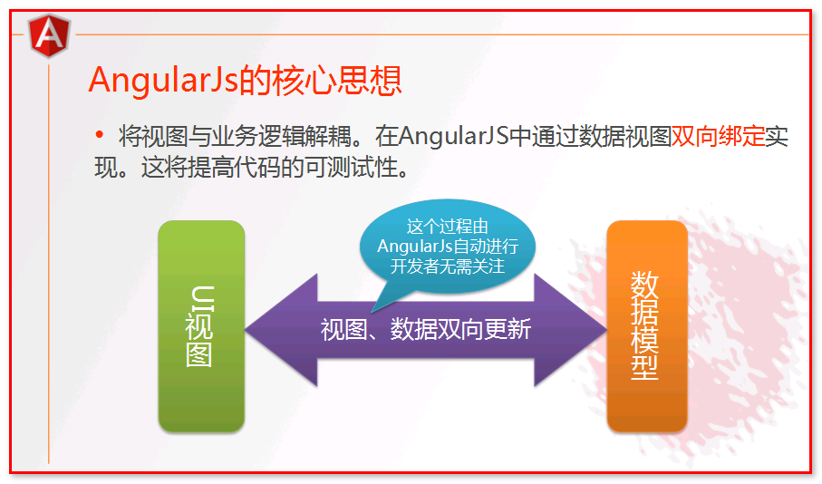

# AngularJS
## Angular简介
>AngularJS[1]  诞生于2009年，由Misko Hevery 等人创建，后为Google所收购。是一款优秀的前端JS框架，已经被用于Google的多款产品当中。AngularJS有着诸多特性，最为核心的是：MVC、模块化、自动化双向数据绑定、语义化标签、依赖注入等等。
AngularJS 是一个 JavaScript框架。它是一个以 JavaScript 编写的库。它可通过 `<script>`标签添加到HTML 页面。
AngularJS 通过 指令 扩展了 HTML，且通过 表达式 绑定数据到 HTML。
AngularJS 是以一个 JavaScript 文件形式发布的，可通过 script 标签添加到网页中。

>Angular是一个强大的前端框架，其强大之处主要是可以把静态页面与动态数据绑定起来。

## Angular入门
**问题:** 平时我们看到的网页界面上面的数据都是固定，但如果我们要变化这些数据，例如我在一个文本框输入，要实时改动一个文本.这时应该怎么做呢?<br>
&emsp;很容易应该想到的是通过js方式改变dom文件,这时页面上应该是通过一个定时器,来监控文本框的变化,然后通过js或者jquery改变固定区域的文本.例如
```html
<div>
  <input type="text" name="name" id="name"></div>
<div>
    Hello,<span id="spanId"></span>
</div>
<script>
  var elementInput = document.getElementById("name");
  setInterval(function () {
    document.getElementById("spanId").innerText=elementInput.value;
  },50)
</script>
```
&emsp;这种方式对于简单的小工程来说也够了.但是对于比较大的工程,考虑的不仅是功能的实现,还包括可维护可扩展,这就需要MVC模式了.如果只用jquery，view的逻辑会和controller，model的逻辑混在一起，不便于维护，例如你在文本框里数据了一个东西，你得用写代码去获取这个值，然后做处理，或者你的某个值改变了，你还得写代码去更新一下view，而angular就是提供这样一个解决方案的框架。

Angular里面的html文件就是view，叫模板（template），当你的数据变化需要改变模板的时候，不用再js代码里面去改变，你可以什么都不做，因为angular神奇的地方就是把模板与数据绑定（data binding），当数据改变的时候模板自动就变了，你的view变了（在文本框输入东西了）也会自动反应到你的数据上面，这就是双向绑定。在angular的理念里面，模板就是一副素描画，数据就是颜色，你想做完这幅画，只需要向模板填充你想要颜色就行了（也就是填充你的数据），例如下面这个例子
```HTML
<script src="./js/angular.min.js" ></script>
<!-- ng-app：是angular编程入口，是模块作用域  -->
<body ng-app>
<div>
  <!-- ng-model：模型作用  -->
  <input type="text" name="name" ng-model="name"/>
</div>
<div>
  <!-- {{}}AngularJS 表达式： 等价于 ng-bind： 视图上用于数据显示 .AngularJS 表达式 很像 JavaScript 表达式：它们可以包含文字、运算符和变量-->
  Hello, {{name}} <br>
  <!--<span ng-bind="name"></span> -->
</div>
```
使用AngularJS 你只需要专注你的数据和模板就够了，他们之间怎么填充，angular把这些做好了，也就是剥离了view层对contorller，mdoel层的影响，简单来说就是你用angular了数据和view自动双向绑定，不用你再代码中去更新，不用angular你还要自己写代码在view变了时候去更新数据，在数据变了的时候去更新view。


*Angular常用属性*
* `ng-app`:AngularJS的程序入口,对该标签内的袁术进行初始化
* `ng-contorller`:在当前元素范围内绑定指定的控制器(controller)
* `ng-model`:	绑定 HTML 控制器的值到应用数据
* `ng-repeat`:定义集合中每项数据的模板
* `{{}}`:花括号表示读取某一属性值
* `filter,orderBy`:过滤器.`filter`可以根据指定的属性过滤数据.`orderBy`是排序过滤器,这两个过滤器都是内置的.过滤器是可以自定义的
