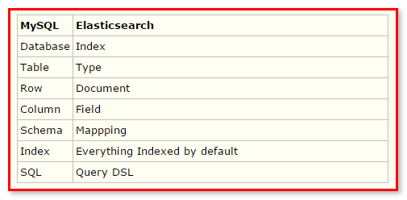

= ElasticSearch

// Settings:
:source-highlighter: prettify
:experimental:
:idprefix:
:idseparator: -
ifndef::env-github[:icons: font]
ifdef::env-github,env-browser[]
:toc: macro
:toclevels: 1
endif::[]
ifdef::env-github[]
:status:
:outfilesuffix: .adoc
:!toc-title:
:caution-caption: :fire:
:important-caption: :exclamation:
:note-caption: :paperclip:
:tip-caption: :bulb:
:warning-caption: :warning:
endif::[]

=== 简介

[quote]
____
ElasticSearch是一个基于Lucene的搜索服务器。它提供了一个分布式多用户能力的全文搜索引擎，基于RESTful web接口。Elasticsearch是用Java开发的，并作为Apache许可条款下的开放源码发布，是当前流行的企业级搜索引擎。设计用于云计算中，能够达到实时搜索，稳定，可靠，快速，安装使用方便。

我们建立一个网站或应用程序，并要添加搜索功能，令我们受打击的是：搜索工作是很难的。我们希望我们的搜索解决方案要快，我们希望有一个零配置和一个完全免费的搜索模式，我们希望能够简单地使用JSON通过HTTP的索引数据，我们希望我们的搜索服务器始终可用，我们希望能够一台开始并扩展到数百，我们要实时搜索，我们要简单的多租户，我们希望建立一个云的解决方案。Elasticsearch旨在解决所有这些问题和更多的问题。

____

=== ElasticSearch 安装配置使用入门

官网:
https://www.elastic.co/products/elasticsearch[https://www.elastic.co/products/elasticsearch]

image::images/elasticsearch_index.png[width="800",align="center"]

官网已经更新到6.1的版本.本文档使用 link:https://download.elastic.co/elasticsearch/release/org/elasticsearch/distribution/zip/elasticsearch/2.4.0/elasticsearch-2.4.0.zip[2.4.0]  版本的ElasticSearch,下载后的目录结构如下:

image::images/elasticsearch.png[width="400",align="center"]

运行elasticSearch/bin/elasticsearch.bat 文件,需要JAVA_HOME的环境变量支持.浏览器访问
http://127.0.0.1:9200

image::images/elasticsearch_access.png[title="安装elasticSearch成功",width="400",align="center"]

[NOTE]
====
- elasticsearch需要安装jdk的版本在1.7.0.72以上，如果使用jdk在1.7.0.52版本会导致jdk版本过低，出现启动elasticsearch.bat时闪退现象。
* 方法一：在环境变量中添加 `JAVA_OPTS ：-XX:-UseSuperWord`
* 方法二：在ElasticSearch/bin/elasticsearch.in.bat文件中添加一行 `set JAVA_OPTS=-XX:-UseSuperWord`
====

== ElasticSearch 插件安装 es head

elasticsearch-head是一个elasticsearch的集群管理工具，它是完全由HTML5编写的独立网页程序，你可以通过插件把它集成到es。或直接下载源码，在本地打开index.html运行它。该工具的Git地址是： https://github.com/Aconex/elasticsearch-head

插件安装方法：

1. 在目录elasticsearch/bin/中运行 `plugin.bat -install Aconex/elasticsearch-head` 或者在 https://github.com/mobz/elasticsearch-head[git] 中下载zip,解压到 `plugins/head` 目录下
2. 运行es
3. 浏览器中打开 `http://localhost:9200/_plugin/head/`

image::images/elasticsearch_start.png[title="elasticsearch-head安装成功",align="center"]

=== Elasticsearch入门案例-创建

===== 基于maven项目的pom文件导入坐标

[source,xml]
----
 <dependencies>
  	<dependency>
  		<groupId>org.elasticsearch</groupId>
  		<artifactId>elasticsearch</artifactId>
  		<version>2.4.0</version>
  	</dependency>
  	<dependency>
  		<groupId>junit</groupId>
  		<artifactId>junit</artifactId>
  		<version>4.12</version>
  	</dependency>
  </dependencies>
----

当直接在ElasticSearch 建立文档对象时，*如果映射不存在的，默认会自动创建*（后续讲手动映射），映射采用默认方式

* ElasticSearch 服务默认端口 *9300*（java代码操作）
* Web 管理平台端口 9200 （rest风格的uri访问，9200）

Elasticsearch 的 Java 客户端非常强大；它可以建立一个嵌入式实例并在必要时运行管理任务。

运行一个 Java 应用程序和 Elasticsearch 时，有两种操作模式可供使用。该应用程序可在 Elasticsearch 集群中扮演更加主动或更加被动的角色。在更加主动的情况下（称为 Node Client），应用程序实例将从集群接收请求，确定哪个节点应处理该请求，就像正常节点所做的一样。（应用程序甚至可以托管索引和处理请求。）。另一种模式称为 Transport Client，它将所有请求都转发到另一个 Elasticsearch 节点，由后者来确定最终目标。

===== 测试代码[[ref_1]]

[source,java]
----
//ElasticSearch 测试程序
@Test
// 直接在ElasticSearch中建立文档，自动创建索引，自动创建映射
public void demo1() throws IOException {
	// 创建连接搜索服务器对象
	Client client = TransportClient
			.builder()
			.build()
			.addTransportAddress(
					new InetSocketTransportAddress(InetAddress
							.getByName("127.0.0.1"), 9300));//服务器对应9300
	// 描述json 数据
	/*
	 * {id:xxx, title:xxx, content:xxx}
	 */
	XContentBuilder builder = XContentFactory.jsonBuilder()
			.startObject()
			.field("id", 1)
			.field("title", "ElasticSearch是一个基于Lucene的搜索服务器")
			.field("content",
					"它提供了一个分布式多用户能力的全文搜索引擎，基于RESTful web接口。"
					+ "Elasticsearch是用Java开发的，并作为Apache许可条款下的开放源码发布，"
					+ "是当前流行的企业级搜索引擎。设计用于云计算中，能够达到实时搜索，稳定，"
					+ "可靠，快速，安装使用方便。")
			.endObject();
	// 建立文档对象
	/**
	 * 参数一blog1：表示索引对象
	 * 参数二article：类型
	 * 参数三1：建立id
	 */
	// 需要注意的时 创建了请求对象,并不发送请求 需要执行,execute()
	IndexRequestBuilder requestBuilder = client.prepareIndex("blog1","article","4").setSource(json);
  // 这里也可以用 get() == execute().actionGet()
	IndexResponse indexResponse = requestBuilder.execute().actionGet();

  System.out.println("索引："+indexResponse.getIndex());
	System.out.println("文档类型："+indexResponse.getType());
	System.out.println("ID："+indexResponse.getId());
	System.out.println("版本："+indexResponse.getVersion());
	// 关闭连接
	client.close();
}
----
===== 程序运行结果

image::images/blog1_type.png[title="文档数据 (type 文档类型 )",align="center"]

[NOTE]
====
代码中的描述json文件也可以使用json字符串和map集合的方式

[source,java]
----
String json = "{" +
    "\"id\":\"2\"," +
		"\"title\":\"基于Lucene的搜索服务器\"," +
		"\"content\":\"它提供了一个分布式多用户能力的全文搜索引擎，基于RESTful web接口\"" +
		"}";
IndexResponse indexResponse = client.prepareIndex("blog1", "article", "2")
    .setSource(json)
     // execute().actionGet == get()
    .get();
----

[source,java]
----
Map<String, Object> json = new HashMap<String, Object>();
		json.put("id", "3");
		json.put("title", "基于Lucene的搜索服务器");
		json.put("content", "它提供了一个分布式多用户能力的全文搜索引擎，基于RESTful web接口");
IndexResponse indexResponse = client.prepareIndex("blog1", "article", "3").
    setSource(json).get();

----
====

最终结果是

===== 通过上面的案例,用Elasticsearch&&Mysql做个对比,加深记忆.
Elasticsearch 集群可以包含多个索引（`Index`），每个索引可以包含多个类型（`Type`），每个类型可以包含多个文档（`Document`），每个文档可以包含多个字段（`Field`）。以下是 `MySQL` 和 `Elasticsearch` 的术语类比图，帮助理解：

[TIP]
====
DSL语言,参考 http://www.jianshu.com/p/f437b893502a
====

===== 小结 ElasticSearch创建索引的大概步骤:

1. 连接服务器( `TransportClient` Elasticsearch中的类)
2. 创建索引(需要index,type,id)
3. 添加文档(文档有三种方式来描述)
4. 通过 `get()或者execute()` 方法 发送请求
5. 关闭连接

=== Elasticsearch入门案例-搜索()

===== 基本查询
直接上代码,通过id查询,获取指定文档信息;

[source,java]
----
@Test
public void getIndexNoMapping() throws Exception {
  // 创建Client连接对象
  Client client = TransportClient.builder().build()
  		.addTransportAddress(new InetSocketTransportAddress(InetAddress.getByName("127.0.0.1"),9300));
  //获取响应
  GetResponse actionGet = client.prepareGet("blog1", "article", "1").execute().actionGet();

  System.out.println(actionGet.getSourceAsString());
  client.close();
}
----
结果

主要步骤跟创建索引时差不多

1. 连接服务器( `TransportClient` `Elasticsearch` 中的类)
2. 请求方式 `client.prepareGet()`
3. 通过 `get()或者execute()` 方法 发送请求
4. `getSourceAsString()` 进行打印输出

===== 复杂查询
主要依赖QueryBuilder对象 ，可以通过QueryBuilders获取各种查询 ：（基于lucene）

* `matchAllQuery()` 查询所有数据
* `queryStringQuery()` 指定条件的搜索
* `termQuery()` 词条查询
* `wildcardQuery()` 通配符查询
* `fuzzyQuery()` 相似度查询
* `boolQuery()` 布尔查询，可以用来组合多个查询条件

*matchAllQuery*
[source,java]
----
@Test
public void searchDocumeng() throws Exception {

  Client client = TransportClient.builder().build()
    .addTransportAddress(new InetSocketTransportAddress(InetAddress.getByName("127.0.0.1"), 9300));
  // 查询请求构建
  SearchRequestBuilder builder = client.prepareSearch("blog1").setTypes("article");
  // 设置查询条件
  SearchResponse response = builder.setQuery(QueryBuilders.matchAllQuery()).get();
  // 获取命中次数，查询结果有多少对象
  SearchHits hits = response.getHits();
  System.out.println("查询结果:"+	hits.getTotalHits());

  // SearchHits接口继承了Iterator接口
  for (SearchHit searchHit : hits) {

    Map<String, Object> map = searchHit.getSource();
    // 根据字段获取title
    System.out.println(":"+map.get("title"));
    // 获取字符串格式打印
    System.out.println(searchHit.getSourceAsString());
    System.out.println("--------------------");
  }
  // 关闭连接
  client.close();
}
----
结果

*queryStringQuery* 搜索结果跟 `matchAllQuery` 一致
[source,java]
----
SearchResponse response = builder.setQuery(QueryBuilders.queryStringQuery("全文")).get();
----
结果

*wildcardQuery* 模糊查询 *任意字符串 ?任意单个字符
[source,java]
----
// 第一个参数:字段名
// 第二个参数:查询字符
SearchResponse response = builder.setQuery(QueryBuilders.wildcardQuery("content", "*全文*")).get();
----
结果

*termQuery* 词条查询
[source,java]
----
// 第一个参数:字段名
// 第二个参数:查询词条
SearchResponse response = builder.setQuery(QueryBuilders.wildcardQuery("content", "*全文*")).get();
----
结果

[TIP]
====
模糊查询和词条查询不到,说明没有 *全文* 这个词条,这是为什么呢？原因是ElasticSearch 默认采用分词器,单个字分词,没有"全文"这个词条,而在 `queryStringquery()` 方法中也是先将 `全文` 分为单字然后在查询

====

=== IK分词器和ElasticSearch集成使用

ElasticSearch 默认采用分词器， 单个字分词 ，效果很差,所以采用 `IK Analyzer` 分词器,开源项目地址 https://github.com/medcl/elasticsearch-analysis-ik/tree/2.x

步骤:

1. 下载开源项目(文档采用 link:https://github.com/medcl/elasticsearch-analysis-ik/archive/v1.10.0.zip[1.10.0] 版本)
2. 进入项目文件 `mvn clean package`
3. 目录中 `target\releases` 下的 `elasticsearch-analysis-ik-1.10.0.zip` 解压到 `elasticsearch-2.4.0\plugins\analysis-ik` 目录下
4. 配置elasticsearch.yml 在 `elasticsearch-2.4.0\config` 中,在文件的最后加入 `index.analysis.analyzer.ik.type: "ik"` 需要注意的是, `:` 后面需要一个空格
5. 重启es 测试,例如 在浏览器中输入 http://localhost:9200/_analyze?analyzer=ik&pretty=true&text=我是中国人 成功显示,如下图

image::ElasticSearch\ElasticSearch-b3a4c.png[title="成功图示",align="center"]

[TIP]
====
ik 的扩展词库 `config/custom/mydict.dic` 用来添加ik不分词的词条,例如:传智播客等等,一些公司的名字

ik 的停用词库 `config/custom/ext_stopword.dic` 停用一些声词,感叹词

修改了词库,重启才能生效
====

=== ElasticSearch 常用编程操作
===== 创建索引(等同于mysql的库)
[source,java]
----
@Test
public void createIndex() throws Exception {
  // 建立连接
  TransportClient client = TransportClient.builder().build()
      .addTransportAddress(new InetSocketTransportAddress(
          InetAddress.getByName("127.0.0.1"),9300));
  // 创建索引 ,执行
  client.admin().indices().prepareCreate("blog2").get();
  //关闭连接
  client.close();
}
----
image::ElasticSearch\ElasticSearch-895e9.png[align="center",title="默认创建好索引，mappings为空"]

===== 删除索引
[source,java]
----
  // 删除索引,执行
client.admin().indices().prepareDelete("blog2").get();
}
----

===== 创建映射
[source,java]
----
@Test
public void createMapping() throws Exception {
	TransportClient client = TransportClient.builder().build()
			.addTransportAddress(new InetSocketTransportAddress(
					InetAddress.getByName("127.0.0.1"),9300));
	// 创建索引
	client.admin().indices().prepareCreate("blog2").get();
	// 添加映射
	XContentBuilder builder = XContentFactory.jsonBuilder()
		.startObject()
			.startObject("article")
				.startObject("properties")
					.startObject("id")
						.field("type","integer").field("store","yes")
					.endObject()
					.startObject("title")
						.field("type", "string").field("store", "yes").field("analyzer", "ik")
					.endObject()
					.startObject("content")
						.field("type", "string").field("store", "yes").field("analyzer", "ik")
					.endObject()
				.endObject()
			.endObject()
		.endObject();
	// 创建映射 请求
	PutMappingRequest mappingRequest = Requests.putMappingRequest("blog2").type("article").source(builder);
	// 执行
	client.admin().indices().putMapping(mappingRequest).get();

	client.close();
}
----
image::ElasticSearch\ElasticSearch-a3210.png[title="执行结果",align="center"]

[TIP]
====
mapping映射的格式为
[source,json]
----
"mappings" : {
  "article" : {
    "dynamic" : "false",
    "properties" : {
      "id" : { "type" : "integer" },
      "title" : { "type" : "string" },
      "content" : { "type" : "string" }
    }
  }
}
----
====
===== 文档相关操作 （CRUD）
回顾：直接在XContentBuilder中构建json数据，建立文档的 <<ref_1,入门案例>>
针对XContentFactory对象创建文档，有些复杂，是否可以使用对象的形式创建呢？
比如:Article这个类将content内容进行封装
[source,java]
----
public class Article {
  private Integer id;
  private String title;
  private String content;
}
----
[NOTE]
====
Jackson 是一个 Java 用来处理 JSON 格式数据的类库，性能非常好。
Jackson可以轻松的将Java对象转换成json对象和xml文档，同样也可以将json、xml转换成Java对象。Jackson库于2012.10.8号发布了最新的2.1版。
Jackson源码目前托管于GitHub，地址： https://github.com/FasterXML/
Jackson 2.x版提供了三个JAR包供下载：
====
1. Core库：`streaming parser/generator`,流式API - 读取并将JSON内容写入作为离散事件。 JsonParser读取数据，而JsonGenerator写入数据。它是三者中最有效的方法，是最低的开销和最快的读/写操作。它类似于Stax解析器XML
下载：
http://repo1.maven.org/maven2/com/fasterxml/jackson/core/jackson-core/2.1.0/jackson-core-2.1.0.jar
2. Databind库：`ObjectMapper`, `Json Tree Model` 树模型 - 准备JSON文件在内存里以树形式表示。 ObjectMapper构建JsonNode节点树。这是最灵活的方法。它类似于XML的DOM解析器。
下载：
http://repo1.maven.org/maven2/com/fasterxml/jackson/core/jackson-databind/2.1.0/jackson-databind-2.1.0.jar
3. Annotations库：`databinding annotations`, 数据绑定 - 转换JSON并从POJO（普通Java对象）使用属性访问或使用注释。它有两个类型。
* 简单的数据绑定 - 转换JSON和Java Maps, Lists, Strings, Numbers, Booleans 和null 对象。
* 全部数据绑定 - 转换为JSON从任何JAVA类型。
* 下载：
http://repo1.maven.org/maven2/com/fasterxml/jackson/core/jackson-annotations/2.1.0/jackson-annotations-2.1.0.jar

从Jackson 2.0起，
核心组件包括：`jackson-annotations`、`jackson-core`、`jackson-databind`。

*Jackson入门案例*

1. 引入jackson 1.x版本

[source,xml]
----
<dependency>
  <groupId>org.codehaus.jackson</groupId>
  <artifactId>jackson-core-asl</artifactId>
  <version>1.9.13</version>
</dependency>
<dependency>
  <groupId>org.codehaus.jackson</groupId>
  <artifactId>jackson-mapper-asl</artifactId>
  <version>1.9.13</version>
</dependency>
----
引入jackson2.x版本
[source,xml]
----
<dependency>
  <groupId>com.fasterxml.jackson.core</groupId>
  <artifactId>jackson-core</artifactId>
  <version>2.8.1</version>
</dependency>
<dependency>
  <groupId>com.fasterxml.jackson.core</groupId>
  <artifactId>jackson-databind</artifactId>
  <version>2.8.1</version>
</dependency>
<dependency>
  <groupId>com.fasterxml.jackson.core</groupId>
  <artifactId>jackson-annotations</artifactId>
  <version>2.8.1</version>
</dependency>
----
