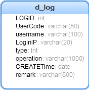

### 背景
>增强日志的记录,尽可能详细的记录用户的操作,方便分地区分操作类型的记录

### 数据表结构


```sql
CREATE TABLE `d_log` (
  `LOGID` int(11) DEFAULT NULL COMMENT '标识(自增)',
  `UserCode` varchar(50) DEFAULT NULL COMMENT '用户代码',
  `username` varchar(100) DEFAULT NULL COMMENT '用户名',
  `LoginIP` varchar(20) DEFAULT NULL COMMENT '登录IP',
  `type` int(11) DEFAULT NULL COMMENT '操作类型',
  `operation` varchar(1000) DEFAULT NULL COMMENT '操作内容',
  `CREATETime` date DEFAULT NULL COMMENT '操作时间',
  `remark` varchar(500) DEFAULT NULL  COMMENT '备注'
) ENGINE=InnoDB DEFAULT CHARSET=utf8;
```
### 日志类型
分成三种类型：登录、查询、修改参数和用户管理。 如果需要详细分操作类型的话,就需要将日志类型 `type` 这字段分细

### 操作内容Operation
由于4种类型的操作都记录在同一张表中，加上这4种类型所需要记录的内容各不相同。所以有以上表结构的调整。共同的信息都记录在除 `Operation` 字段外的其它字段中。而 `Operation` 字段则是用来记录这4种类型具体的操作内容。

为了方便存储和读取，我们采用Json字符串的形式记录具体的操作内容。

Json字符串的形式为：

`{“para1”:”value1”, “para2”:”value2”, “para3”:"value3”, “para...n”:”value…n”}`

其中： `para` 为参数， `value` 为值。

由此，如果用户进行了一个查询的操作，我们可以记录为：

`{“查询类型”:“值”, “查询名称”:“值”, “公司”:“值”,……….}`

又如，进行用户管理时：

`{“姓名”:“新值”, “状态”:“新值”, “旧角色”:“角色1，角色2”, “新角色”:“角色1，角色2”,……….}`

这样，我们就可以记录任意我们想记录的信息了（只要存储字段设得足够大）。